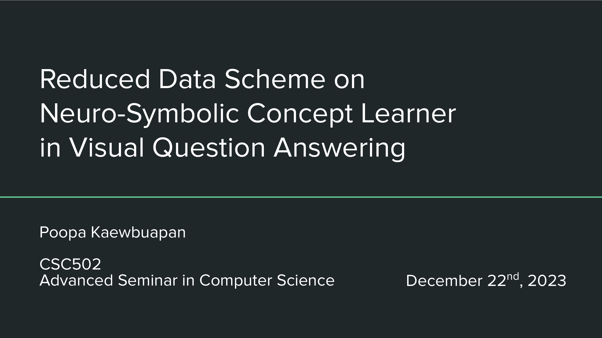

# Abstract
Neuro-Symbolic Concept Learner offers alternative approach in
visual question and answering task by utilizing symbolic module in
reasoning and enjoys competitive performance while also being fully
interpretable model; although limited in semantic generalization due
to requirement of domain-specific language. Meanwhile, current SOTA
that are pre-trained vision transformer-based models are versatile in
domain shifts across different datasets at a cost of requiring massive
training data and also suffer from interpretability issue. By striking a
balance between both worlds, interpretable neuro-symbolic can enjoys
generalization power while still being modest in training data usage.
We proposed a neuro-symbolic model ReducedNSCL based on NS-CL
architecture that separate visual perception and symbolic reasoning
into modules and replace with MDETR object detector and attention-
based OCCAM visual symbolic model respectively. Then we compare
the accuracy of NS-CL and ReducedNSCL using CLEVR synthetic
and VQAv2 real-world datasets with equal training data to see if Re-
ducedNSCL can outperform NS-CL and with 1% and 10% training
data for few-shot scenario. Lastly, we speculated that ReducedNSCL
additional knowledge from both domain generalization capability and
traceable symbolic reasoning are responsible for reducing training data
to mastered VQA task, demonstrate the model genuine understanding
of the task learned.

